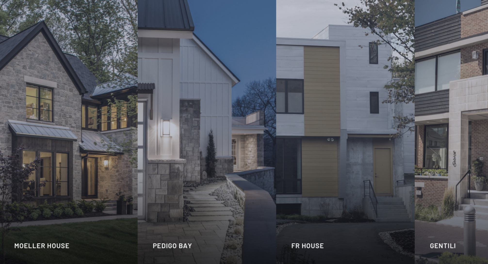

# Demerly Architects
> Written by [Ryan Haskell-Glatz](mailto:ryan.nhg@gmail.com), last updated on __June 11th, 2019__.

::: tip "What is this document?"
Welcome to our functional specification, the complete guide through our latest understanding of the project.

As this project evolves, you can expect updates will be documented here!
:::

## Table of Contents

[[toc]]

## Overview

### Project Structure

The project is broken up into four phases:

1. __Design and Planning__

    The site design and functional specification will be shared with the client. From there, we can easily discuss the planned design and features. This is the easiest time to add features and change direction, so feedback is welcome!

1. __Build__

    Once the designs and specification have been approved, our team will begin the website build. A link will be provided to the client to share the latest progress. The components, page templates, and other website features can be accessed using the link provided.

1. __Testing__

    After the features have been built out, we will enter the testing phase. Here, the client will be able to enter content in the CMS, providing feedback on any issues they experience. When the site is ready, it will be launched, and enter the final phase.

1. __Support__

    After site launch, the project is in support mode. This means any work on additional features or issues will be charged at an hourly rate. All updates will also be reflected in the functional specification, so it remains a reliable source of information for the client and future website maintainers.

### Updating Content

_Demerly Architects_ will be able to make updates to the site using a content management system (commonly referred to as a CMS).

After launch, the CMS will be accessible at: [https://www.demerlyarchitects.com/admin](https://www.demerlyarchitects.com/admin).

All __labels__ and __images__ displayed on the site will be editable via the CMS.

Design assets, such as colors, fonts, and icons will not be editable.

### Sharing Build Progress

As the site is being built, we will provide a __password-protected__ URL to share progress.

This will allow _Demerly Architects_ to experience the latest work being done on the site before launch.

### Supported Browsers

The following browsers will be supported:

- Chrome 73
- Firefox 66
- Safari 12
- Edge 18
- IE 11

### Tested Devices

The site will be mobile, tablet, and desktop friendly.

Here are the devices and resolutions that the site will be tested on:

Device Name | Resolution
:-- | :--
Desktop Computer | `1920x1080`
Laptop Computer | `1366x768`
Apple iPhone 6/7/8 | `375x667`
Apple iPad (Portrait) | `768x1024`
Apple iPad (Landscape) | `1024x768`
Android Pixel 2 | `411x731`

## Sitemap

When content has been entered, this is the structure you can expect to find.

Non-bolded rows represent dynamic pages, which only appear if a page has been created in the CMS.

Title | URL | Page Template
:-- | :-- | :--
__Demerly Architects__ | `/` | [Homepage](#homepage)
__Projects \| Demerly Architects__ | `/projects` | [Project Landing](#project-landing)
Pedigo Bay \| Projects \| Demerly Architects | `/projects/pedigo-bay` | [Project Detail](#project-detail)
FR House \| Projects \| Demerly Architects | `/projects/fr-house` | [Project Detail](#project-detail)
__Process \| Demerly Architects__ | `/process` | [Process](#process)
__Profile \| Demerly Architects__ | `/profile` | [Profile Landing](#profile-landing)
Karl Karlsen \| Profile \| Demerly Architects | `/profile/karl-karlsen` | [Profile Detail](#profile-detail)
__Contact \| Demerly Architects__ | `/contact` | [Contact](#contact)

## Page Templates

1. [Homepage](#homepage)
1. [Project Landing](#project-landing)
1. [Project Detail](#project-detail)
1. [Process](#process) <Badge type="warn" text="in-progress" />
1. [Profile Landing](#profile-landing)
1. [Profile Detail](#profile-detail)
1. [Contact](#contact) <Badge type="warn" text="in-progress" />

### Homepage

__Designs__

<ResponsiveDesigns
  label="Homepage"
  mobile="/images/pages/homepage-mobile.png"
  desktop="/images/pages/homepage.jpg"
/>

__Contains Components__

1. [Header](#header)
1. [Footer](#footer)
1. [Share Tools](#share-tools)
1. [Pane Carousel](#pane-carousel)

### Project Landing

__Designs__

<ResponsiveDesigns
  label="Project Landing"
  mobile="/images/pages/project-landing-mobile.jpg"
  desktop="/images/pages/project-landing.jpg"
/>

__Contains Components__

1. [Header](#header)
1. [Footer](#footer)
1. [Share Tools](#share-tools)
1. [Filter Hero](#filter-hero)
1. [Project Results](#project-results)

### Project Detail

__Designs__

<ResponsiveDesigns
  label="Project Detail"
  mobile="/images/pages/project-detail-mobile.jpg"
  desktop="/images/pages/project-detail.jpg"
/>

__Contains Components__

1. [Header](#header)
1. [Footer](#footer)
1. [Share Tools](#share-tools)
1. [Detail Carousel](#detail-carousel)

### Process

__Designs__

<ResponsiveDesigns
  label="Process"
  desktop="/images/pages/process.png"
/>

__Contains Components__

1. [Header](#header)
1. [Footer](#footer)
1. [Share Tools](#share-tools)
1. [Split View](#split-view)

### Profile Landing

__Designs__

<ResponsiveDesigns
  label="Profile Landing"
  desktop="/images/pages/profile-landing.jpg"
/>

### Profile Detail

__Designs__

<ResponsiveDesigns
  label="Profile Detail"
  mobile="/images/pages/profile-detail-mobile.jpg"
  desktop="/images/pages/profile-detail.jpg"
/>

__Contains Components__

1. [Header](#header)
1. [Footer](#footer)
1. [Share Tools](#share-tools)
1. [Profile Content](#profile-content)

### Contact

__Designs__

<!--  -->
::: warning Still being designed
This page doesn't have a design yet, stay tuned!
:::

<!-- __Contains Components__

1. [Header](#header)
1. [Footer](#footer)
1. [Share Tools](#share-tools)
1. [Contact Form](#contact-form) -->

## Components

1. [Header](#header)
1. [Footer](#footer)
1. [Share Tools](#share-tools)
1. [Pane Carousel](#pane-carousel)
1. [Filter Hero](#filter-hero)
1. [Project Results](#project-results)
1. [Detail Carousel](#detail-carousel)
1. [Split View](#split-view)
1. [Profile Content](#profile-content)
1. [Contact Form](#contact-form)

### Header

### Footer

### Share Tools

### Pane Carousel

### Filter Hero

### Project Results

### Detail Carousel

### Split View

### Profile Content

### Contact Form

::: warning Still being designed
This component doesn't have a design yet.
:::

## Content

This is an overview of the content this site will need. Additionally, this section will let you know if the content needs to be uploaded from scratch, or if it can be automatically imported from the existing site.

Examples are also included where useful.

### Site Settings

Field | Type | Example
:-- | :-- | :--
Site Name | `text` | Demerly Architects
Site Description | `text` | Demerly Architects is a fullservice architectural studio specializing in custom residential design.`
Projects Label | `text` | Projects
Process Label | `text` | Process
Profile Label | `text` | Profile
Contact Label | `text` | Contact
Menu Label | `text` | Menu
Address Line 1 | `text` | 6500 Westfield Boulevard
Address Line 2 | `text` | Indianapolis, IN 46220
Phone | `text` | 317.847.0724
Fax | `text` | 888.895.2811
Share Label | `text` | Share

### Homepage

Field | Type | Example
:-- | :-- | :--
Featured Projects | `List of Projects` | `fr-house`, `pedigo-bay`

### Project Landing

Field | Type | Example
:-- | :-- | :--
Title | `text` | Projects
Description | `rich text` | Demerly Architects is a fullservice architectural studio specializing in custom residential design.
Filter Label | `text` | Filter by
All Label | `text` | All

### Projects

Field | Type | Example
:-- | :-- | :--
Title | `text` | Pedigo Bay
Location | `text` | Indianapolis
Year | `number` | 2019
Tags | `select` | `residential`
Description | `rich text` | Lorem ipsum dolor sit amet, consectetur adipiscing elit, sed do eiusmod tempor incididunt ut labore et dolore magna aliqua.
Images | `List of images` | `/images/fr-house.jpg`, `/images/fr-house-2.jpg`

### Process

Field | Type | Example
:-- | :-- | :--
Title | `text` | Projects
Description | `rich text` | Designing, building, and updating with a vision.
Overview | `rich text` | Every project begins with clients... bringing to life the space we imagined together.
Image | `image` | `/images/process-bg.jpg`

### Person

Field | Type | Example
:-- | :-- | :--
Name | `text` | Karl Karlsen
Image | `image` | `/images/people/karl.png`
Title | `text` | AIA, NCARB, LEED-AP Vice President
Phone | `text` | 317.847.0724
Fax | `text` | 888.895.2811
Email | `text` | karl@demerlyarchitects.com
Bio | `richText` | Raised in a small town on the west side... developing his knowledge in the field of architecture.
